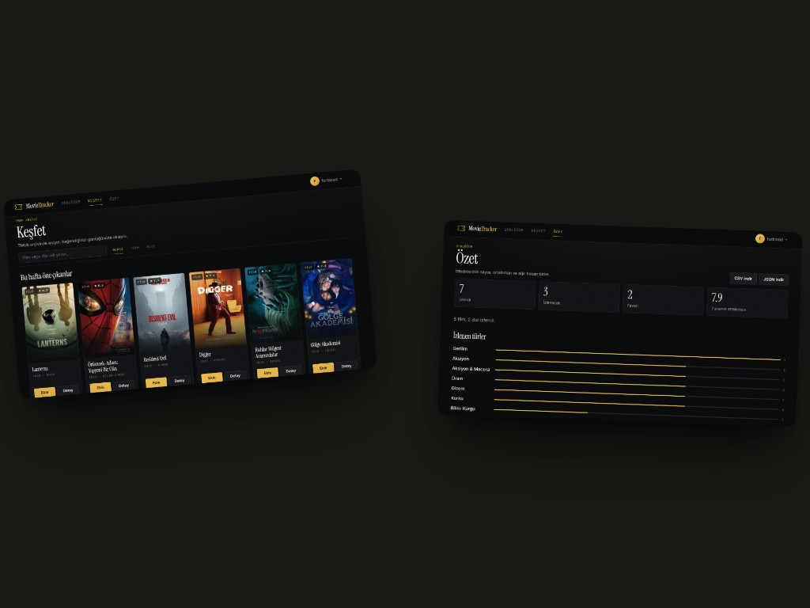

# Movie Tracker

İzlediğin her şey, tek defterde.

Movie Tracker, film ve diziler için kişisel bir sinema günlüğüdür. Bir yapımı izledin ya da sıraya aldın; puanını, kısa notunu ve tarihini yazdın. Günlük yalnızca sana görünür. Arama [TMDb](https://www.themoviedb.org/) arşivinden gelir; puanların ve notların bu hesapta kalır.

**HTML · CSS · Vanilla JS · Node.js · SQLite · TMDb**

Harici npm paketi yok. Sunucu yerleşik Node modülleriyle çalışır (`node:http`, `node:sqlite`). TMDb anahtarı yalnızca sunucuda durur.





Ürün henüz herkese açık değil. Aşağıdaki metin, yayından önce ne yaptığını ve nasıl çalıştırılacağını anlatır.

## Kim için

Başkasına göstermek için değil, kendin için tutulan bir defter. Sosyal akış, takipçi veya herkese açık profil yok. Hesap için kullanıcı adı ve şifre yeter; e-posta istenmez.

## Ne yaparsın

- **Günlük.** İzlendi, izlenecek ve favoriler. Tür, puan, yıl ve ada göre süzer, başlıkta ararsın.
- **Puan ve not.** Yarım yıldız, izleme tarihi ve kısa bir yazı. Gelecek tarih kabul edilmez.
- **Keşfet.** TMDb’de ara ya da haftanın öne çıkanlarına bak. Detayda süre, sezon sayısı ve oyuncular görünür.
- **Özet.** Kaç yapım izlediğin, ortalama puanın, türlerin ve yılların. Günlüğü JSON veya CSV olarak indirirsin.
- **Hesap.** Şifreni değiştirirsin. İstersen kullanıcı adı ve şifre onayıyla hesabı ve günlüğü birlikte silersin.

Afişler ve yapım bilgileri TMDb arşivinden gelir. This product uses the TMDB API but is not endorsed or certified by TMDB.

## Ekranlar

| Adres | Ekran |
| ----- | ----- |
| `/` | Karşılama. Oturum yokken ürünün ilk yüzü |
| `/giris`, `/kayit` | Giriş ve kayıt. Solda editoryal satır, sağda form. Davet kodu yalnızca davet modunda |
| `/gunluk` | Günlük: sekmeler, tür, sıralama, arama, sayfalama |
| `/kesfet` | TMDb arama ve haftanın öne çıkanları |
| `/ozet` | Sayılar, tür dağılımı, yıllar; JSON ve CSV indirme |
| `/gizlilik`, `/kosullar` | Gizlilik bildirimi ve kullanım koşulları. İletişim adresi `CONTACT_EMAIL` ile gelir |

## Görünüm

Arayüz koyu bir sinema salonu gibi durur. Zemin kömür, tek vurgu sıcak altın (`#e8b84b`); doygun renk afişlerde kalır. Başlıklar Instrument Serif, gövde metni Inter. Fontlar `public/assets/fonts` altından sunulur. Kartlar bilet koçanı formundadır: alt şeritte izleme tarihi, koparma çizgisinde yarım daire delik izleri. Tema `:root` değişkenlerinden beslenir.

## Geliştirme

Node.js **v22.5+** (önerilen: v24+). `node:sqlite` bu sürümlerde yerleşiktir.

```bash
node --version

# Ortam dosyasını hazırla
cp .env.example .env      # Windows PowerShell: Copy-Item .env.example .env

# .env içindeki TMDB_API_KEY alanını doldur
# https://www.themoviedb.org/settings/api

npm start                 # veya: node src/server.js
npm run dev               # dosya değişiminde yeniden başlatma
```

Ardından: <http://127.0.0.1:3000>

`npm install` gerekmez. İlk açılışta `data/movie-tracker.sqlite` oluşur ve şema migrasyonları uygulanır. Sıfırdan başlamak için: `npm run db:reset`.

## Proje yapısı

```
.
├── docs/                   # README görselleri
├── public/                 # İstemci (statik olarak sunulur)
│   ├── index.html
│   ├── assets/
│   ├── styles/main.css
│   └── scripts/            # ES module'ler: app, api, görünümler, kart, modal
├── src/
│   ├── server.js           # HTTP çekirdeği
│   ├── config.js           # .env ayrıştırıcı
│   ├── db/                 # Bağlantı, migrasyon, şema
│   ├── lib/                # HTTP, yönlendirici, statik dosya, log
│   └── routes/
├── scripts/                # Şifre sıfırlama ve uçtan uca testler
└── data/                   # SQLite dosyası (git'e girmez)
```

## Veritabanı şeması (v2)

| Tablo          | Amaç                                                                  |
| -------------- | --------------------------------------------------------------------- |
| `users`        | Kullanıcılar; `scrypt` + rastgele salt ile hash'lenmiş şifreler       |
| `sessions`     | Sunucu taraflı oturumlar; çerezde yalnızca rastgele `session_id`      |
| `entries`      | İzleme günlüğü kayıtları (durum, puan, yorum, izleme tarihi)          |
| `entry_genres` | Kayıt ↔ TMDb türü ilişkisi (tür filtresi ve filtre menüsü için)       |
| `tmdb_cache`   | TMDb yanıtlarının kısa süreli önbelleği                               |

Ayrıntılar `src/db/schema.sql` içindedir. Şema sürümü `PRAGMA user_version` ile takip edilir; uygulanmış migrasyonlar değiştirilmez.

| Sürüm | Dosya                          | İçerik                                                                    |
| ----- | ------------------------------ | ------------------------------------------------------------------------- |
| v1    | `schema.sql`                   | Başlangıç şeması                                                          |
| v2    | `v2-remove-dropped-status.sql` | `status` yalnızca `watched` / `watchlist`; eski `dropped` kayıtları silinir |

## Güvenlik

- **SQL Injection:** tüm sorgular `db.prepare(...)` + bağlı parametre
- **Şifreler:** `crypto.scryptSync` + kullanıcıya özel 16 baytlık salt; karşılaştırma `timingSafeEqual`
- **Oturum çerezi:** `HttpOnly; SameSite=Strict; Path=/` (üretimde `Secure`)
- **Path traversal:** yüzde çözümü, NUL baytı reddi, `path.normalize` / `resolve`, dosyanın `public/` içinde olması
- **İstek gövdesi:** 1 MB üst sınır; bozuk JSON 400 döner
- **Başlıklar:** `Content-Security-Policy`, `X-Content-Type-Options: nosniff`, `X-Frame-Options: DENY`
- **API anahtarı:** yalnızca sunucu belleğinde; istemci `/api/tmdb/*` proxy'sini kullanır
- **İstemci IP'si:** `X-Forwarded-For` yalnızca `TRUST_PROXY=true` iken okunur
- **Davet kodu:** SHA-256 özetleri `timingSafeCompare` ile sabit sürede karşılaştırılır
- **XSS:** metinler `textContent` ile yazılır; `innerHTML` kullanılmaz

## API

| Yöntem | Adres                | Gövde / açıklama                                              |
| ------ | -------------------- | ------------------------------------------------------------- |
| GET    | `/api/health`        | Sunucu, veritabanı ve TMDb yapılandırma durumu                |
| POST   | `/api/auth/register` | `{ username, password, email?, displayName?, inviteCode? }` → 201 + oturum |
| POST   | `/api/auth/login`    | `{ username, password }` → 200 + oturum çerezi                |
| POST   | `/api/auth/logout`   | 204; oturumu siler, çerezi temizler                           |
| GET    | `/api/auth/me`       | Oturum yoksa `{ user: null }` + `registration.mode`           |
| POST   | `/api/auth/password` | `{ currentPassword, newPassword }`; diğer oturumları düşürür  |
| DELETE | `/api/auth/account`  | `{ username, password }` → hesabı ve günlüğü siler, `204`     |

`inviteCode` yalnızca `REGISTRATION_MODE=invite` iken zorunludur. `registration.mode` kayıt ekranının ve davet kodu alanının çizilmesi için kullanılır; kodun kendisi istemciye gönderilmez. Kayıt formunda e-posta sorulmaz.

TMDb proxy uçları oturum gerektirir:

| Yöntem | Adres                          | Açıklama                                                     |
| ------ | ------------------------------ | ------------------------------------------------------------ |
| GET    | `/api/tmdb/search`             | `?query=matrix&type=multi\|movie\|tv&page=1`                 |
| GET    | `/api/tmdb/trending`           | `?window=week\|day` — arama kutusu boşken keşif listesi      |
| GET    | `/api/tmdb/:mediaType/:tmdbId` | Detay: tür, süre, sezon/bölüm sayısı, ilk 10 oyuncu          |

Günlük uçları oturum gerektirir; her kullanıcı yalnızca kendi kayıtlarına erişir:

| Yöntem | Adres                  | Açıklama                                                       |
| ------ | ---------------------- | -------------------------------------------------------------- |
| GET    | `/api/entries`         | Filtre, sıralama, sayfalama                                    |
| GET    | `/api/entries/genres`  | Günlükteki türler ve kayıt sayıları                            |
| GET    | `/api/entries/stats`   | Özet: sayılar, izlenen türler, yıllar, en yüksek puanlar       |
| GET    | `/api/entries/export`  | Tüm günlük. `?format=json` (varsayılan) veya `csv`             |
| POST   | `/api/entries`         | Yeni kayıt; içerik zaten varsa `409` + `details.existingEntryId` |
| GET    | `/api/entries/:id`     | Tek kayıt                                                      |
| PATCH  | `/api/entries/:id`     | Kısmi güncelleme; `null` alanı temizler                        |
| DELETE | `/api/entries/:id`     | `204`                                                          |

`GET /api/entries` sorgu parametreleri:

| Parametre               | Değerler                                                    |
| ----------------------- | ----------------------------------------------------------- |
| `status`                | `watched` \| `watchlist`                                    |
| `mediaType`             | `movie` \| `tv`                                             |
| `genreId`               | TMDb tür kimliği (örn. `18`)                                |
| `minRating`/`maxRating` | 1–10                                                        |
| `unrated`               | `true` — yalnızca puanlanmamışlar                           |
| `favorite`              | `true`                                                      |
| `search`                | Başlıkta veya özgün başlıkta arama                          |
| `sort`                  | `updated` \| `created` \| `rating` \| `title` \| `watched` \| `year` |
| `order`                 | `asc` \| `desc`                                             |
| `page` / `limit`        | `limit` en fazla 100 (varsayılan 24)                        |

Kayıt alanları: `tmdbId`, `mediaType`, `title`, `originalTitle`, `overview`, `posterPath`, `releaseYear`, `status`, `rating` (1–10, yarım yıldız), `review`, `watchedAt` (`YYYY-MM-DD`), `favorite`, `genres` (`[{ id, name }]`).

### Kurallar ve limitler

- Kullanıcı adı: 3–32 karakter, `a-z A-Z 0-9 . _ -`
- Şifre: en az 8 karakter, kullanıcı adıyla aynı olamaz
- Giriş: aynı IP + kullanıcı adı için 15 dakikada 10 başarısız deneme (aşılırsa 429 + `Retry-After`)
- Giriş: IP başına 15 dakikada 60 deneme. Kullanıcı adını değiştirerek sınırı aşmayı ve `scrypt` ile CPU tüketmeyi keser; başarılı girişte sıfırlanmaz
- Kayıt: IP başına saatte 20 deneme / 5 oluşturulan hesap

## Yayın notları

Ürün henüz yayında değil. Yayın gününde uzun ömürlü bir Node süreci ve yazılabilir disk gerekir; sunucusuz platformlarda (Vercel, Netlify) çalışmaz.

| Değişken            | Canlı değer            | Neden                                                            |
| ------------------- | ---------------------- | ---------------------------------------------------------------- |
| `NODE_ENV`          | `production`           | Erişim logları, üretim önbellek başlıkları, `Secure` çerez       |
| `TRUST_PROXY`       | `true`                 | Ters proxy arkasındaysanız; proxy yokken açmayın                 |
| `REGISTRATION_MODE` | `invite` veya `closed` | Açık kayıt, yabancıların TMDb kotasını harcaması demektir        |
| `INVITE_CODE`       | uzun rastgele değer    | `invite` modunda zorunlu                                         |
| `HOST`              | `127.0.0.1`            | Proxy aynı makinedeyse; konteynerde `0.0.0.0`                    |

Oturum çerezi üretimde `Secure` olduğu için HTTPS gerekir. Düz HTTP üzerinde tarayıcı çerezi göndermez ve giriş sessizce başarısız olur. Caddy örneği:

```caddyfile
gunluk.example.com {
    reverse_proxy 127.0.0.1:3000
}
```

Caddy sertifikayı alır, yeniler ve `X-Forwarded-For` başlığını yazar. HTTPS olmayan bir iç ağda `COOKIE_SECURE=false` ile bilinçli olarak kapatılabilir.

Hatalı yapılandırma açılışta yakalanır: geçersiz `REGISTRATION_MODE`, kodsuz `invite` modu veya `TRUST_PROXY` yazım hatası sunucuyu başlatmaz.

### Şifre sıfırlama

“Şifremi unuttum” akışı yok; e-posta göndermek harici bir servis gerektirirdi. Şifreyi sunucuya erişen kişi sıfırlar. İşlem kullanıcının tüm oturumlarını düşürür:

```bash
npm run reset-password -- kullaniciadi              # rastgele şifre üretir ve yazdırır
npm run reset-password -- kullaniciadi YeniSifre123 # belirli bir şifre atar
```

## Testler

Harici test kütüphanesi yok. `node:assert` ve `fetch` ile yazılmış duman testleri:

```bash
npm start                                   # 1. terminal
npm run test:auth -- http://127.0.0.1:3000  # 2. terminal
npm run test:tmdb -- http://127.0.0.1:3000  # gerçek TMDb API'sine çıkar
npm run test:entries -- http://127.0.0.1:3000
npm run check:frontend                      # istemci söz dizimi ve import denetimi
```

Her koşuda benzersiz kullanıcı adı üretildiği için testler veritabanını temizlemeyi gerektirmez. `check:frontend`, tarayıcıda çalışan istemci kodunun söz dizimini, `import` / `export` tutarlılığını ve `innerHTML` kullanımını denetler.
